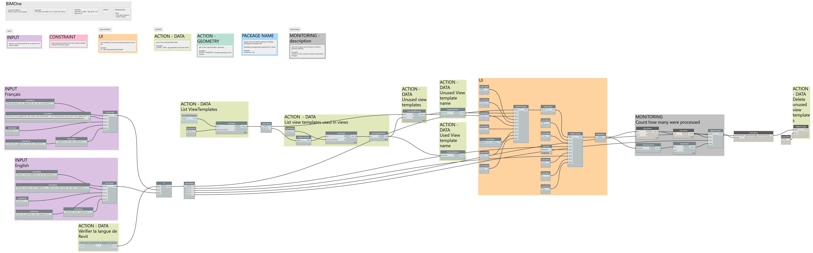

# DeleteUnusedViewTemplates

## Capture
 

## Démonstration

https://github.com/bimone/scripts-dynamo/blob/main/BIM1_DeleteUnusedViewTemplates/BIM1_DeleteUnusedViewTemplates_FR.mp4

 

## *Demo*

https://github.com/bimone/scripts-dynamo/blob/main/BIM1_DeleteUnusedViewTemplates/BIM1_DeleteUnusedViewTemplates_EN.mp4

