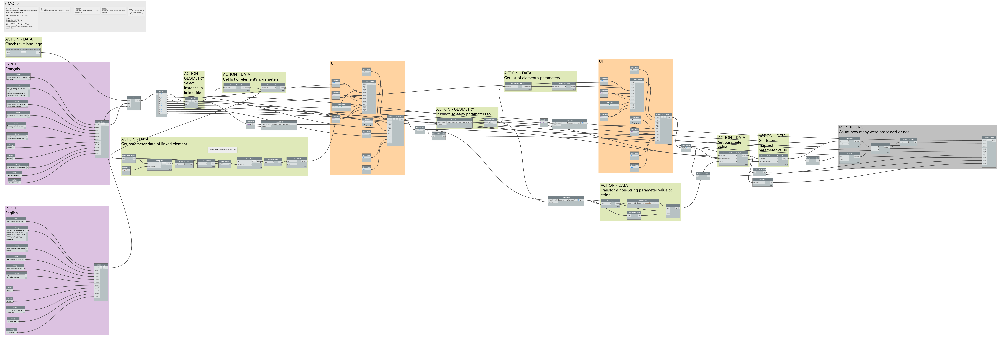

# LinkedItemData2CurrentFileItemData

## Capture
 

## Démonstration

https://github.com/bimone/scripts-dynamo-documentation/blob/main/BIM1_LinkedItemData2CurrentFileItemData/BIM1_LinkedItemData2CurrentFileItemData_FR.mp4

 

## *Demo*

https://github.com/bimone/scripts-dynamo-documentation/blob/main/BIM1_LinkedItemData2CurrentFileItemData/BIM1_LinkedItemData2CurrentFileItemData_ENG.mp4
