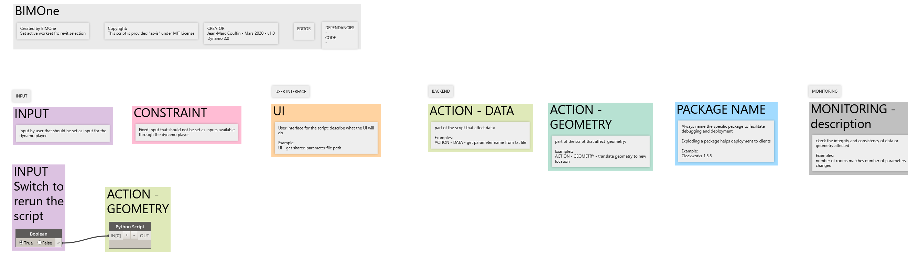

# SetActiveWorkset
 
Cette fonctionnalité est maintenant disponible dans [pyRevit](https://github.com/eirannejad/pyRevit)

*This tool is now available of [pyRevit](https://github.com/eirannejad/pyRevit)*

## Capture
 

## Démonstration

https://user-images.githubusercontent.com/7872003/125451531-c2421ab5-268b-4b7e-8421-af92f5beca27.mp4

 

## *Demo*

https://user-images.githubusercontent.com/7872003/125451591-a49caebf-29ff-4001-92a7-f9bcb414d942.mp4
